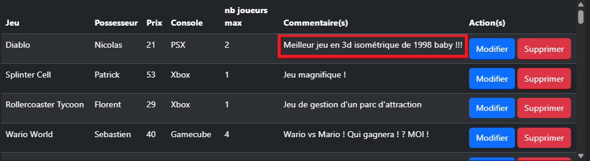

# Support PHP Intermédiaire Programme 2025
Créé le 24 Juin 2025
## Table des matières

* [Retour au plan](./README.md)
* [Principes de la POO](./01-principes-de-la-poo.md)
* [Traitement des formulaires](./02-formulaires.md)
* [Exceptions](./03-exceptions.md)
* [PDO](./04-pdo.md)

# PDO
## Principes

PDO ou "Php Data Object" est un moyen de se connecter à une base de données et un moyen de manipuler cette bdd. Son avantage tiens dans le fait qu'on utilise les mêmes méthodes pour manipuler des bases de données différentes (MySql, PostGre, Oracle, etc.).

## Connexion avec PDO
Il faut pour se connecter :

* L'hôte
* le nom de la bdd
* le charset utilisé dans la bdd
* identifiant utilisateur bdd
* mot de passe utilisateur bdd

```new PDO("mysql:host=‹nom de l'hôte›;dbname=‹nom bdd›; charset=‹jeu de caractère bdd›", "‹nom de l'utilisateur›", "‹mdp utilisateur›");```

```php
//exemple
$bdd = new PDO("mysql:host=localhost;dbname=026-php-inter-poo;charset=UTF8", "root", "");
```
Tester la connexion
```php
<?php
try{
    $bdd = new PDO('mysql:host=localhost;dbname=039-php-intermediaire;charset=UTF8', 'root', '', array(PDO::ATTR_ERRMODE, PDO::ERRMODE_EXCEPTION));
    echo '<p>La connexion fonctionne.</p>';
    Tools::prePrint($bdd);
}
catch(Exception $e){
    die('Erreur de connexion : ' . $e->getMessage());
}
?>
```
**Résultat :**
```La connexion fonctionne.```
```
D:\wamp64\www\039-php-intermediaire\src\Utils\Tools.php:14:
object(PDO)[2]
```
## Requêter avec PDO
On peut utiliser la méthode query
```php
<?php
$response = $bdd->query("SELECT * FROM `jeux_video`");
Tools::prePrint($response);
?>
```
**Résultat :**
```
D:\wamp64\www\039-php-intermediaire\src\Utils\Tools.php:14:
object(PDOStatement)[3]
  public string 'queryString' => string 'SELECT * FROM `jeux_video`' (length=26)
```

\$response contient désormais le jeu d'enregistrements récupéré via la requête. On ne peut pas exploiter \$response directement, il va falloir utliser les méthodes de PDO désormais utilisables avec \$response.

```php
<?php
$unEnregistrement = $response->fetch(PDO::FETCH_ASSOC);
Tools::prePrint($unEnregistrement);
Tools::prePrint($unEnregistrement['nom']);
$unEnregistrement = $response->fetch(PDO::FETCH_BOTH);
Tools::prePrint($unEnregistrement);
Tools::prePrint($unEnregistrement['nom']);
Tools::prePrint($unEnregistrement[1]);
$unEnregistrement = $response->fetch(PDO::FETCH_NUM);
Tools::prePrint($unEnregistrement);
Tools::prePrint($unEnregistrement[1]);
?>
```
**Résultat :**
```
D:\wamp64\www\039-php-intermediaire\src\Utils\Tools.php:14:
array (size=9)
  'ID' => int 1
  'nom' => string 'Super Mario Bros' (length=16)
  'possesseur' => string 'Florent' (length=7)
  'console' => string 'NES' (length=3)
  'prix' => float 4
  'nbre_joueurs_max' => int 1
  'commentaires' => string 'Un jeu d'anthologie !' (length=21)
  'date_ajout' => string '2024-04-30 16:17:29' (length=19)
  'date_modif' => string '2024-04-30 16:17:29' (length=19)
D:\wamp64\www\039-php-intermediaire\src\Utils\Tools.php:14:string 'Super Mario Bros' (length=16)
D:\wamp64\www\039-php-intermediaire\src\Utils\Tools.php:14:
array (size=18)
  'ID' => int 2
  0 => int 2
  'nom' => string 'Sonic' (length=5)
  1 => string 'Sonic' (length=5)
  'possesseur' => string 'Patrick' (length=7)
  2 => string 'Patrick' (length=7)
  'console' => string 'Megadrive' (length=9)
  3 => string 'Megadrive' (length=9)
  'prix' => float 2
  4 => float 2
  'nbre_joueurs_max' => int 1
  5 => int 1
  'commentaires' => string 'Pour moi, le meilleur jeu du monde !' (length=36)
  6 => string 'Pour moi, le meilleur jeu du monde !' (length=36)
  'date_ajout' => string '2024-04-30 16:17:29' (length=19)
  7 => string '2024-04-30 16:17:29' (length=19)
  'date_modif' => string '2024-04-30 16:17:29' (length=19)
  8 => string '2024-04-30 16:17:29' (length=19)
D:\wamp64\www\039-php-intermediaire\src\Utils\Tools.php:14:string 'Sonic' (length=5)
D:\wamp64\www\039-php-intermediaire\src\Utils\Tools.php:14:string 'Sonic' (length=5)
D:\wamp64\www\039-php-intermediaire\src\Utils\Tools.php:14:
array (size=9)
  0 => int 3
  1 => string 'Zelda : ocarina of time' (length=23)
  2 => string 'Florent' (length=7)
  3 => string 'Nintendo 64' (length=11)
  4 => float 15
  5 => int 1
  6 => string 'Un jeu grand, beau et complet comme on en voit rarement de nos jours' (length=68)
  7 => string '2024-04-30 16:17:29' (length=19)
  8 => string '2024-04-30 16:17:29' (length=19)
D:\wamp64\www\039-php-intermediaire\src\Utils\Tools.php:14:string 'Zelda : ocarina of time' (length=23)
```

fetch() renvoie l'enregistrement actuel où se trouve le curseur dans le jeu d'enregistrement. Une fois qu'il a renvoyé les données, le curseur passe à l'enregistrement suivant.

Il faut, une fois qu'on a finit d'utiliser les données, "fermer" le curseur.

```php
<?php
$response->closeCursor();
$unEnregistrement = $response->fetch(PDO::FETCH_ASSOC);
Tools::prePrint($unEnregistrement);
Tools::prePrint($response);
?>
```
**Résultat :**
```
D:\wamp64\www\039-php-intermediaire\src\Utils\Tools.php:14:boolean false
D:\wamp64\www\039-php-intermediaire\src\Utils\Tools.php:14:
object(PDOStatement)[3]
  public string 'queryString' => string 'SELECT * FROM `jeux_video`' (length=26)
```

## Exploiter les résultats

Maintenant, on relance la requête et on va afficher les résultats dans un tableau généré par une boucle

```php
<?php
$response = $bdd->query("SELECT * FROM `jeux_video` ORDER BY `ID` DESC");
?>
<div class="table-responsive" style="height: 300px;">
    <table class="table table-dark table-striped">
        <thead>
            <tr>
                <th>Jeu</th>
                <th>Possesseur</th>
                <th>Prix</th>
                <th>Console</th>
                <th>nb joueurs max</th>
                <th>Commentaire(s)</th>
                <th>Action(s)</th>
            </tr>
        </thead>
        <tbody>
            <?php
            while($donnees = $response->fetch(PDO::FETCH_ASSOC)){
            ?>
                <tr>
                    <td><?php echo $donnees['nom'] ?></td>
                    <td><?php echo $donnees['possesseur'] ?></td>
                    <td><?php echo $donnees['prix'] ?></td>
                    <td><?php echo $donnees['console'] ?></td>
                    <td><?php echo $donnees['nbre_joueurs_max'] ?></td>
                    <td><?php echo $donnees['commentaires'] ?></td>
                    <td style="width: 250px;">
                        <a href="./actionJV.php?action=mod&idJV=<?php echo $donnees['ID'] ?>"><button class="btn btn-primary">Modifier</button></a> 
                        <a href="./actionJV.php?action=sup&idJV=<?php echo $donnees['ID'] ?>"><button class="btn btn-danger">Supprimer</button></a>
                    </td>
                </tr>
            <?php
            
            }
            ?>
        </tbody>
    </table>
</div>
<?php
$response->closeCursor();
?>
```
**Résultat :**


## Les requêtes préparées
Si on veut pouvoir choisir des paramètres pour la recherche (comme des filtres), il faut utiliser les méthodes PDO de préparation de requête.

Avec le formulaire suivant :


```php
<?php
/* variables pour créer les conditions de la requête de recherche */
$tabField = [];
$tabConditions = [];
$conditions = '';

if( isset($_GET['soumettre']) && $_GET['soumettre'] === 'soumettre' ){
    if( isset($_GET['possesseur']) && $_GET['possesseur'] !== '' ){
        $tabField['possesseur'] = $_GET['possesseur'];
        $tabConditions[] = ' `possesseur` = :possesseur ';
    }

    if( isset($_GET['prixmax']) && $_GET['prixmax'] !== '' ){
        $tabField['prixmax'] = $_GET['prixmax'];
        $tabConditions[] = ' `prix` <= :prixmax ';
    }

    if( isset($_GET['console']) && $_GET['console'] !== '' ){
        $tabField['console'] = $_GET['console'];
        $tabConditions[] = ' `console` = :console ';
    }

    /* on crée un petit algo qui va permettre de gérer les conditions selon le ou les champs remplis du formulaire */
    if( count($tabConditions) > 0){
        for($i = 0; $i < count($tabConditions); $i++){
            $conditions .= (($i === 0)? ' WHERE ': ' AND ');
            $conditions .= $tabConditions[$i];
        }
    }
}

$sql = 'SELECT * FROM `jeux_video` '.$conditions.' ORDER BY `nom`';

echo $sql.'<br />'.print_r($tabField).'<br />';

$req = $bdd->prepare($sql);
$req->execute($tabField);

?>
<div class="table-responsive" style="height: 300px;">
    <table class="table table-dark table-striped">
        <thead>
            <tr>
                <th>Jeu</th>
                <th>Possesseur</th>
                <th>Prix</th>
                <th>Console</th>
                <th>nb joueurs max</th>
                <th>Commentaire(s)</th>
            </tr>
        </thead>
        <tbody>
            <?php
            while($donnees = $req->fetch(PDO::FETCH_ASSOC)){
            ?>
                <tr>
                    <td><?php echo $donnees['nom'] ?></td>
                    <td><?php echo $donnees['possesseur'] ?></td>
                    <td><?php echo $donnees['prix'] ?></td>
                    <td><?php echo $donnees['console'] ?></td>
                    <td><?php echo $donnees['nbre_joueurs_max'] ?></td>
                    <td><?php echo $donnees['commentaires'] ?></td>
                    
                </tr>
            <?php
            
            }
            ?>
        </tbody>
    </table>
</div>
<?php
$req->closeCursor();
?>
```
**Résultat :**
En recherchant possesseur = Patrick


## Manipulation des enregistrements
### Ajoût de données
  

```php
<?php
$tabField = [];
Tools::prePrint($_POST);

/* Gestion des champs pour préparer la requête d'ajoût de données */
if( isset($_POST['ajoutJeu']) && $_POST['ajoutJeu'] === 'ajoutJeu' ){
    if( isset($_POST['nom']) && $_POST['nom'] !== '' ){
        $tabField['nom'] = $_POST['nom'];
    }

    if( isset($_POST['possesseur']) && $_POST['possesseur'] !== '' ){
        $tabField['possesseur'] = $_POST['possesseur'];
    }
    
    if( isset($_POST['console']) && $_POST['console'] !== '' ){
        $tabField['console'] = $_POST['console'];
    }

    if( isset($_POST['prix']) && $_POST['prix'] !== '' ){
        $tabField['prix'] = floatval($_POST['prix']);
    }
    
    if( isset($_POST['nbJmax']) && $_POST['nbJmax'] !== '' ){
        $tabField['nbre_joueurs_max'] = intval($_POST['nbJmax']);
    }
    
    if( isset($_POST['commentaires']) && $_POST['commentaires'] !== '' ){
        $tabField['commentaires'] = $_POST['commentaires'];
    }

    Tools::prePrint($tabField);

    $keys = '(';
    $values = '(';

    /* algo de création des clefs et valeurs de la requête */
    $i = 0;
    foreach($tabField as $key => $value){
        if($i !== 0){
            $keys .= ', ';
            $values .= ', ';
        }
        $i++;
        $keys .= $key;
        $values .= ':'.$key;
    }

    $keys .= ')';
    $values .= ')';
    $sql = 'INSERT INTO `jeux_video` '.$keys. ' VALUES '.$values. ';';
    Tools::prePrint($sql);
    $req = $bdd->prepare($sql);
    $req->execute($tabField) or die(Tools::prePrint($bdd->errorInfo()));
    ?>
    <script>
        document.location.href="./pdo.php";
    </script>
    <?php
}
?>
```
Une fois le jeu ajouté

 

### Modification des données

On clique sur le bouton "Modifier" pour le jeu Diablo appartenant à Nicolas

En arrivant sur la page on vérifie qu'il s'agit d'une modification et non d'une suppression

```php
$formMod = false; // booleen modification
$formSup = false; // booleen suppression

if( isset($_GET['action']) && isset($_GET['idJV']) && $_GET['action'] !== '' && $_GET['idJV'] !== ''){
    $idJV = $_GET['idJV'];
    $formMod = ($_GET['action'] === 'mod'); // true si mod sinon false
    $formSup = ($_GET['action'] === 'sup'); // true si suppr sinon false
    $sql = 'SELECT * FROM `jeux_video` WHERE `ID` = :id';
    $req = Tools::modBdd($sql, ['id' => $idJV]);
    $infosJeu = $req->fetch(PDO::FETCH_ASSOC);
    // on récupère les informations du jeu
    $nom = $infosJeu['nom'];
    $possesseur = $infosJeu['possesseur'];
    $console = $infosJeu['console'];
    $prix = $infosJeu['prix'];
    $nbre_joueurs_max = $infosJeu['nbre_joueurs_max'];
    $commentaires = $infosJeu['commentaires'];
    $id = $infosJeu['ID'];
}
```

le formulaire en cas de modification

```php
<?php if($formMod){ ?>
<h3>Modifier le jeu </h3>
<form method="post" action="./actionJV.php">
    <input type="hidden" name="ID" value="<?php echo $id ?>" />
    <fieldset class="form-group my-2">
        <label for="nom" class="form-label">Nom</label>
        <input type="text" class="form-control" name="nom" id="nom" value="<?php echo $nom ?>" />
    </fieldset>
    <fieldset class="form-group my-2">
        <label for="possesseur" class="form-label">Possesseur</label>
        <input type="text" class="form-control" name="possesseur" id="possesseur" value="<?php echo $possesseur ?>" />
    </fieldset>
    <fieldset class="form-group my-2">
        <label for="console" class="form-label">Console</label>
        <input type="text" class="form-control" name="console" id="console" value="<?php echo $console ?>" />
    </fieldset>
    <fieldset class="form-group my-2">
        <label for="prix" class="form-label">Prix</label>
        <input type="text" class="form-control" name="prix" id="prix" value="<?php echo $prix ?>" />
    </fieldset>
    <fieldset class="form-group my-2">
        <label for="nbJmax" class="form-label">Nombre de joueurs max</label>
        <input type="text" class="form-control" name="nbre_joueurs_max" id="nbre_joueurs_max" value="<?php echo $nbre_joueurs_max ?>" />
    </fieldset>
    <fieldset class="form-group my-2">
        <label for="commentaires" class="form-label">Commentaire</label>
        <input type="text" class="form-control" name="commentaires" id="commentaires" value="<?php echo $commentaires ?>" />
    </fieldset>
    <p class="my-2">
        <button class="btn btn-outline-primary" name="modBdd" type="submit" value="modJeu">Modifier le jeu</button>
    </p>
</form>
<?php
}
?>
```

 

Quand les données sont envoyées :

```php
/* Cas modification du jeu */
$modBdd = false; // quand on arrive sur la page et qu'on n'a pas envoyé de formulaire

if(isset($_POST['modBdd'])){
    switch($_POST['modBdd']){
        case 'modJeu':
            $sql = '
            UPDATE `jeux_video`
            SET 
            `nom` = :nom,
            `possesseur` = :possesseur,
            `console` = :console,
            `prix` = :prix,
            `nbre_joueurs_max` = :nbre_joueurs_max,
            `commentaires` = :commentaires,
            `date_modif` = now() 
            WHERE 
            ID = :ID;
            ';
            $modBdd = true;
            // comme on est sur une modification, on met le booleen de modification à true
            break;
        default:
            $modBdd = false;
    }
}
// si la modification de la base de donnée est vraie
if($modBdd){
    $params = $_POST;
    unset($params['modBdd']); 
    Tools::modBdd($sql, $params);
    // quand la modification de la base de donnée est effectuée, on redirige vers la page d'affichage de tous les jeux
    header('location: ./pdo.php');
}

?>
```

**Résultat :**



### Suppression des données

On clique sur le bouton "Supprimer" pour le jeu Diablo appartenant à Nicolas

En arrivant sur la page on vérifie qu'il s'agit d'une suppression et non d'une modification

```php
$formMod = false; // booleen modification
$formSup = false; // booleen suppression

if( isset($_GET['action']) && isset($_GET['idJV']) && $_GET['action'] !== '' && $_GET['idJV'] !== ''){
    $idJV = $_GET['idJV'];
    $formMod = ($_GET['action'] === 'mod'); // true si mod sinon false
    $formSup = ($_GET['action'] === 'sup'); // true si suppr sinon false
    $sql = 'SELECT * FROM `jeux_video` WHERE `ID` = :id';
    $req = Tools::modBdd($sql, ['id' => $idJV]);
    $infosJeu = $req->fetch(PDO::FETCH_ASSOC);
    // on récupère les informations du jeu
    $nom = $infosJeu['nom'];
    $possesseur = $infosJeu['possesseur'];
    $console = $infosJeu['console'];
    $prix = $infosJeu['prix'];
    $nbre_joueurs_max = $infosJeu['nbre_joueurs_max'];
    $commentaires = $infosJeu['commentaires'];
    $id = $infosJeu['ID'];
}
```

Le formulaire en cas de suppression :

```php
<?php
if($formSup){
?>    
    <h3>Supprimer le jeu </h3>
    <form method="post" action="./actionJV.php">
        <input type="hidden" name="ID" value="<?php echo $id ?>" />
        Êtes-vous sûr de vouloir supprimer le jeu suivant : <b><?php echo $nom ?></b> ?
        <p class="my-2">
            <button class="btn btn-outline-danger" name="modBdd" type="submit" value="supJeu">Supprimer le jeu</button>
            <a href="./pdo.php"><button class="btn btn-outline-secondary" type="button">Annuler</button></a>
        </p>
    </form>
<?php
}
?>
```


On ajoute la condition au switch du code de modification

```php
/* Cas modification ou suppression du jeu */
$modBdd = false; // quand on arrive sur la page et qu'on n'a pas envoyé de formulaire

if(isset($_POST['modBdd'])){
    switch($_POST['modBdd']){
        case 'modJeu':
            $sql = '
            UPDATE `jeux_video`
            SET 
            `nom` = :nom,
            `possesseur` = :possesseur,
            `console` = :console,
            `prix` = :prix,
            `nbre_joueurs_max` = :nbre_joueurs_max,
            `commentaires` = :commentaires,
            `date_modif` = now() 
            WHERE 
            ID = :ID;
            ';
            $modBdd = true;
            // comme on est sur une modification, on met le booleen de modification à true
            break;
        case 'supJeu':
            $sql = '
            DELETE FROM `jeux_video` 
            WHERE ID = :ID;
            ';
            $modBdd = true;
            break;
        default:
            $modBdd = false;
    }
}
// si la modification de la base de donnée est vraie
if($modBdd){
    $params = $_POST;
    unset($params['modBdd']); 
    Tools::modBdd($sql, $params);
    // quand la modification de la base de donnée est effectuée, on redirige vers la page d'affichage de tous les jeux
    header('location: ./pdo.php');
}

?>
```

